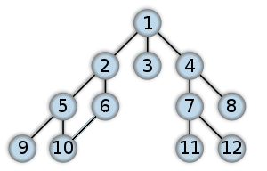
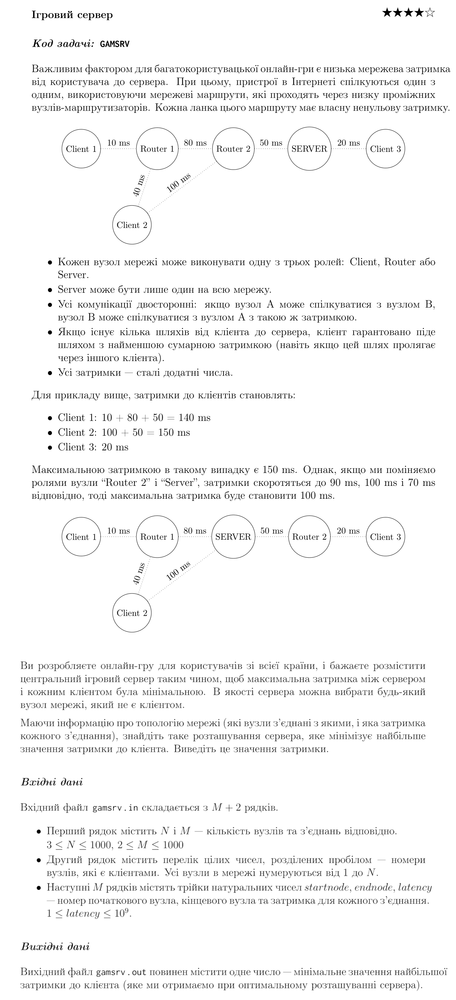

# Lab from university

## Working with graph using bfs algorithm

### Task 1

Given conected undirected graph. Check whether it has cycles or not.

For example, the next graph has the cycle 2–5–10–6–2:

An adjacency list has to be used for the graph represantation, which is read from file `input.txt`.
Result (`true` or `false`) has to be written to the file `output.txt`.

### Task 2

